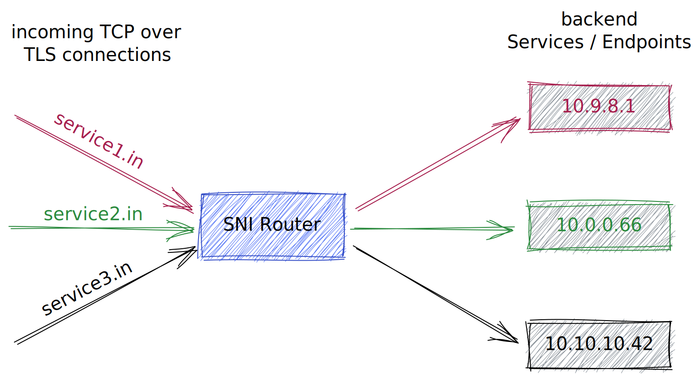

# Docker and Kubernetes Examples for SNI-Routing

*A typical use case*: You are using a single proxy/ingress service and need to access different services with different DNS / host names so you need some kind of router to do the job.

In HTTP traffic this is done using the header information. For TCP traffic there is a different possibility if using TCP over TLS called SNI routing. Here traffic is routed to backend servers / endpoints using the *server_name* in the SNI extension in TLS.

## Working Examples
- **nginx-tls-passthrough** - NGINX OSS example with docker compose

## WIP
- **nginx-tls-termination** - NGINX OSS example with docker compose

- **haproxy-tls-passthrough** - HAProxy example with docker compose

## TODO
- **Caddy** - https://caddyserver.com/docs/modules/tls.handshake_match.sni https://caddy.community/t/how-can-i-use-proxy-ssl-name-for-sni-in-caddy-2/7739 https://medium.com/@panda1100/how-to-setup-layer-4-reverse-proxy-to-multiplex-tls-traffic-with-sni-routing-a226c8168826 https://caddyserver.com/docs/json/apps/http/servers/routes/match/host/ https://caddyserver.com/docs/caddyfile/concepts#addresses 
